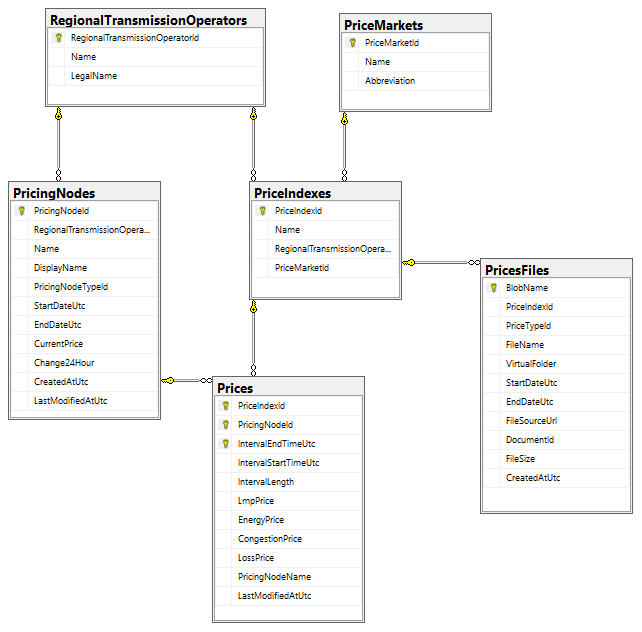

# LMP Prices

https://lmpprices.vercel.app/

# Project Description

- Downloads historical and current LMP prices for multiple energy markets and provides a dashboard for a user to view real-time price changes and historical price trends for any pricing node.
- Additional information:
    - LMP (Locational Marginal Prices) = Energy + Congestion + Losses
    - RTO (Regional Transmission Operator) = Energy transmission system operator
    - Day-ahead prices are published by 1 PM for the day ahead which triggers the opening of the real-time market

# Services

## PostgreSQL Database



- This runs as an Azure managed database for PostgreSQL
- Table notes
    - Price Index
        - RTO + Market
        - Ex: CAISO - Day-Ahead
    - Pricing Node
        - An aggregated pricing node for a specific RTO
        - Maintains current price and the change over 24 hours
    - Prices File
        - Files that have been downloaded to Azure
    - Prices
        - Price intervals for a Pricing Node and Price Index

## File Storage

- Prices files are uploaded to Azure Blob Storage
- Files are organized into remote folders and include metadata
- There is an Event Grid event subscription on the container to trigger the processor function

## Functions

### Prices Downloader

- Using a timer trigger, download prices files as XML/CSV/Excel and upload to Azure.
- NOTE: some RTOs published unique files to be downloaded and others have APIs where you request prices by market, date range, and pricing nodes.
- Download current and historical prices
    - Day-Ahead
        - Each day, the RTO will publish the day-ahead prices for the following day
        - Every hour from 14 through 23, attempt to download these prices
    - Real-Time
        - Every 5 minutes, look for new real-time prices
        - New prices should be available every 5 minutes in the form of a new file or included in an API request for the current day
        - For RTOs with APIs, we merge downloaded intervals with whatever is previously existing
    - Historical
        - Every 12 hours, download historical prices for the current and previous months
        - This rolling download ensures we never miss any prices

### Prices File Processor

- When a file is uploaded to the Azure Blob Storage, a function is triggered via an event grid subscription to process the file and write its price intervals to the database
- Use XML schemas or Excel/CSV parsers to convert file contents into price intervals and save to the database
- Merge price intervals and prices files

### Price Updater

- A hosted service that runs when the API starts up
- On start, seed the database with historical prices going back 3 years
- Every 10-20 seconds, refresh the current prices for each pricing node

## API

- GraphQL
    - Subscriptions
        - Pricing Node - Current Price Change
            - Send a topic event from the Price Updater service on current price update
    - Queries
        - Pricing Nodes
            - All
            - By ID
            - By Name
            - Prices
                - Get prices by "Change Span" (Hour, Day, Month, etc.)
        - Price Indexes
            - All
            - By ID
            - Prices
                - Get prices by "Change Span" (Hour, Day, Month, etc.)
        - Price Markets / Pricing Node Types / RTOs
            - All
            - By ID
        - Missing Intervals
            - Find missing price intervals for a Price Index and date range
- Example queries/subscriptions
    - Pricing Node by RTO / Name with Prices
        ```
          pricingNodeByRtoAndName(rto: CAISO, name: "SP15") {
            name
            prices(span: DAY) {
              priceIndexId
              intervalEndTimeUtc
              lmpPrice
            }
          }
        ```
    - RTO with Pricing Nodes with Prices
        ```
          regionalTransmissionOperatorById(id: CAISO) {
            name
            pricingNodes {
              name
              prices(span: DAY) {
                priceIndexId
                intervalEndTimeUtc
                lmpPrice
              }
            }
          }
        ```
    - Current Price Change subscription
        ```
        subscription {
          onCurrentPriceChange {
            name
            currentPrice
            change24Hour
            lastModifiedAtUtc
          }
        }
        ```

## UI

- The UI is a Next.js w/ Typescript app
- It uses the GraphQL Code Generator (https://the-guild.dev/graphql/codegen) to generate the GraphQL schema and types
- It uses Apollo to query and subscribe to data from the GraphQL server
- It uses Material UI to generate a theme with light and dark modes
- It uses C3 to generate D3-based charts
- The UI consists of two pages:
    - Home (Prices Dashboard)
        - In this page, we fetch all pricing nodes with their current prices and change over 24 hours
        - Prices are automatically updated via GraphQL subscription
        - These prices are shown in the ticker as well as in the pricing nodes list next to each chart
        - For each RTO and pricing node type, we display a list of nodes and a chart
            - This chart initially contains the average prices for each market
            - You can select pricing nodes to bring them into the chart
    - Pricing Node
        - For a single pricing node (RTO + node name), we fetch the current price and historical data to be shown in a chart
        - The current price live updates

# Technologies

- .NET 6
- Hot Chocolate (GraphQL)
    - Subscriptions
    - DataLoaders
- EF Core
- IHostedService (background task)
- PostgreSQL
- Fly.io
- Next.js
- Apollo
- GraphQL Code Generator
- Material UI
- C3 (charts)
- Emotion (styled components)
- Vercel
- Azure
    - PostgreSQL
    - Storage Account
    - App Service (API)
    - Functions
        - Timer Trigger
        - Event Grid Trigger
- Github Actions (CI/CD)
- NodaTime
- ClosedXML (Excel)
- xUnit
- Moq
- Serilog

# Patterns

- Clean architecture
- Dependency Injection
- Task-based Asynchronous Pattern
- Open/Closed Principle / Strategy
    - Have an implementation of each service contract for each RTO
        - Ex: prices file downloader
    - Get service by RTO at runtime using factories
- Factory
- Extension methods

# Project Structure

- Core
    - Prices.Core
        - Domain
            - Domain models and enums
        - Application
            - Contracts, exceptions, xsd classes, and application specific models/enums
- Infrastructure
    - Prices.AzureBlobStorage
        - Azure blob storage client
    - Prices.Downloader.Function
        - Trigger function to download historical/daily prices
    - Prices.Downloader.Services
        - Service implementations for downloading prices and uploading to Azure blob storage
    - Prices.FileProcessor.Function
        - Blob function for processing prices files and writing to the database
    - Prices.GraphQl
        - GraphQL server implementation
    - Prices.Persistence
        - Database implementation
    - Prices.PriceUpdater
        - Service for seeding prices and constantly updating current prices
- API
    - Prices.Api
        - API that runs the GraphQL server and launches the Banana Cake Pop IDE
        - Also runs the Price Updater hosted service
- Tests
    - Prices.Downloader.Tests
        - Downloader tests
        - NodaTime tests
        
# How To Run

## fly.io

- Install / Sign Up / Sign In
    - https://fly.io/docs/hands-on/install-flyctl/
- Sign In
    - `flyctl auth login`
- Create a postgres database
    - `flyctl postgres create --volume-size 3 -n prices -p <password>`
    - Initial cluster size = 1
- Proxy the database locally
    - `flyctl proxy 5432 -a prices`
- Connect
    - `Host=localhost;Username={username};Password={password};Database={databaseName};`

## User secrets

- Add `SqlConnection` and `SasUri` in the API and Function projects (and `SasUri` in the Tests project)
    - Ex:
        ```
        {
          "SqlConnection": "Host=localhost;Username=postgres;Password={password};Database=prices",
          "SasUri": "https://{project}.blob.core.windows.net/prices?......."
        }
        ```
- Add `CorsOrigin` in the API project
    - Ex: `"CorsOrigins": [ "http://localhost:3000" ]`
- Add a connection to the container named `Prices` in the `Prices.EventGrid.Function` project
    - Ex: `"Prices": "DefaultEndpointsProtocol=https;AccountName={accountName};AccountKey={accountKey};BlobEndpoint=https://{storageAccount}.blob.core.windows.net/;TableEndpoint=https://{storageAccount}.table.core.windows.net/;QueueEndpoint=https://{storageAccount}.queue.core.windows.net/;FileEndpoint=https://{storageAccount}.file.core.windows.net/",`
- Add a `.env` file to the frontend project with the following secret keys:
    - `NEXT_PUBLIC_GRAPHQL_HTTP_ENDPOINT`
    - `NEXT_PUBLIC_GRAPHQL_WS_ENDPOINT`

## EF Core Migrations

- Create the database using the `update-database` command in the Package Manager Console or Terminal
    - Set `Prices.API` as the startup project and selected `Prices.Persistence` as the default project in the Package Manager Console

## Run

- Run the Windows Azure Storage Emulator
    - Ex:
        ```
        SET emu="%programfiles(x86)%\Microsoft SDKs\Azure\Storage Emulator\AzureStorageEmulator.exe"
        %emu% stop
        %emu% clear all
        %emu% start
        ```
- Start a new instance of `Prices.EventGrid.Function`
    - Note: since this is an Event Grid trigger, uploading files to the container will not automatically trigger this function. Google how to execute this type of trigger or use the Blob Trigger (`Prices.FileProcessor.Function`) which works based on polling and will, therefore, automatically trigger (note: this causes a lot transactions to be generated in your storage account which can cost money)
- Start a new instance of `Prices.Downloader.Function`
- Start a new instance of `Prices.API`
- Run the `prices-frontend` project: `npm run dev`
